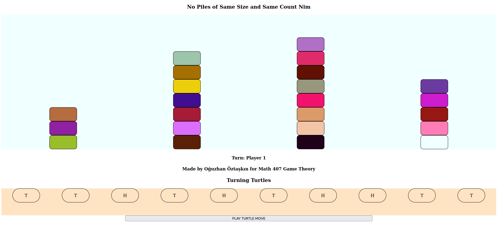

# Turning Turtles Nim
This game is made for Mathematics 407 Game Theory course to demonstrate the Turning Turtles game is equivalent to Nim with a small modification: Since Turning Turtles cannot select a "T" turtle, such a move should not be allowed in the Nim game either. That is, all piles of the same size and *even* count are removed.

The game can be played by either selecting turtles to turn on the interface below and clicking submit or selecting a chip from a nim pile from which all the chips above (selected chip itself is included) are removed.

## Notes
- You are playing against CPU which always makes the perfect moves when there is any. So, a single wrong move will make you lose.
- Though you are always the first player, it might be the case that nim sum of the piles is 0. So you might have started a game which is impossible to win.
- It is also possible that you might start to a game where there are no piles.
- It is possible to start a 2 player game, however, there is no option for that in UI.

## How to build?
- Run `webpack --mode=production` to build.
- You need `index.html, index.css` and `dist` folder and its contents on the same directory for game to load.

Note that you do not need a web server to run this locally.

## Images
